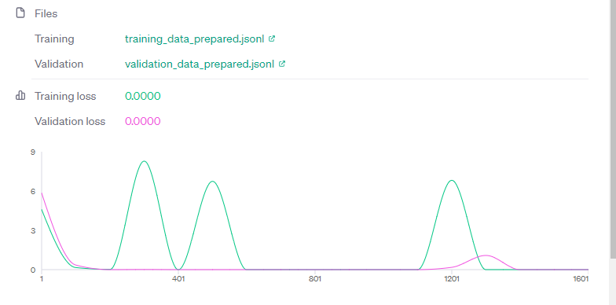

# Training the EduGram Classifier

We fine-tuned OpenAI's GPT-3 1B model.

Why? For convenience and time reasons.

This isn't actually recommend at scale. Due to it's cost.

You can rather train a token classifier on your own, and it'll be much more cheaper.

# Dataset

The dataset used was for a previous project related to TikTok.

Where did we got it from? We labeled the data by hand... Yeah.

In label_data.csv.
- Video ID, Description, Transcription

Which evenually turns into training_data_prepared.jsonl in the step below as the data that's going to be fine-tuned with.

# Prepping dataset
Mostly just data-preprocessing for the AI to actually process properly.

Steps are in prepping_fine_tune.ipynb.

# Training
Used openai to run the fine-tune with this file.

These were the results:

